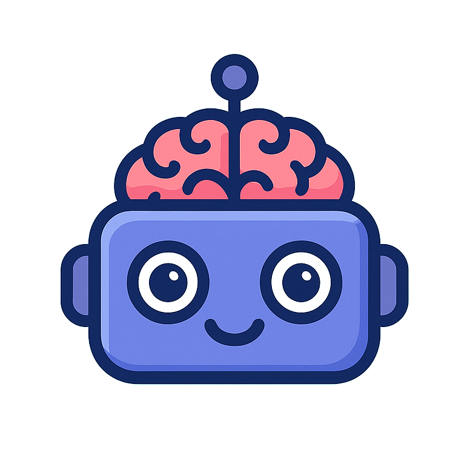

# BrainBuzz

> _Take a break and take a quiz!_

| Discord bot | Slack bot | Quiz Engine |
| ----------- | --------- | ----------- |
|    |       |  |

    

**BrainBuzz** is a Slack and Discord bot that creates quizzes for you and your friends and colleagues on...

- 🏯 **Anime**
- 💥 **Comics**
- 🕹 **Video Games**
- 🎼 **Music**
- 🔭 **Science & Nature**

and many more...

## History

BrainBuzz was developed originally at a summer internship at [Victory Square Partners](https://victorysquarepartners.com/) with fellow contributors, then later extended by [me](https://github.com/raulariton).

The current repository serves as a monorepo for all three components of the project. The original repositories can be viewed at:

- [Slack bot](https://github.com/raulariton/brainbuzz-slack-bot)
- [Discord bot](https://github.com/raulariton/brainbuzz-quiz-engine)
- [Quiz engine](https://github.com/raulariton/brainbuzz-quiz-engine)

## Availability

BrainBuzz is currently in development and will soon be available for public use in your servers.

## Features

Currently, with BrainBuzz you can:

- Create _one-question_ quizzes for your friends and colleagues, which can last from 30 seconds up to a day.
- See results and player ranking of quizzes after they finish.

Upcoming features:

- Create **multiple-question** quizzes (by selecting how many questions you would like to have)
- View your BrainBuzz performance in a server (total quizzes played, total right answers, ranking in server)
- View the top players in a server (those who answered correctly the most, as well as those who have played the most)
- Give Discord roles to the top players in a server (e.g. "BrainBuzz champion")

Nice-to-have features:

- Create **custom quizzes**, with custom quizzes and answers for every server BrainBuzz is in.
- Set a language for quizzes and only take quizzes in that language.
